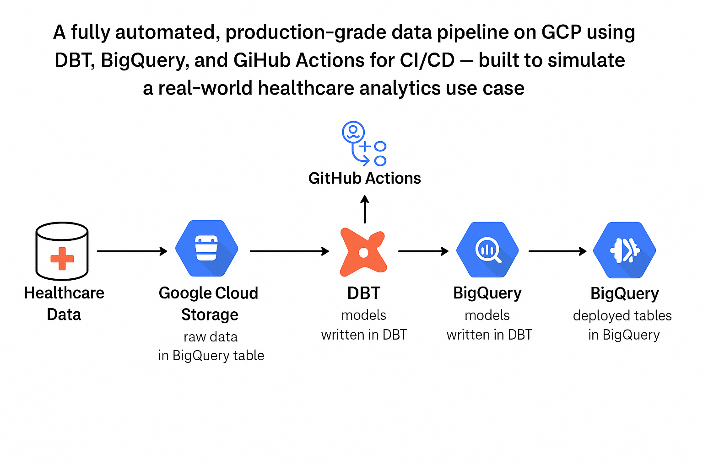
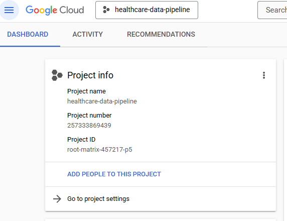
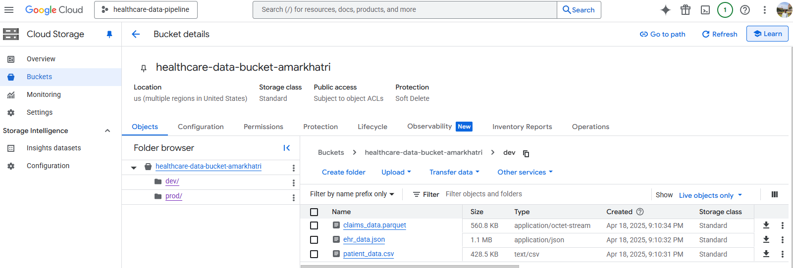
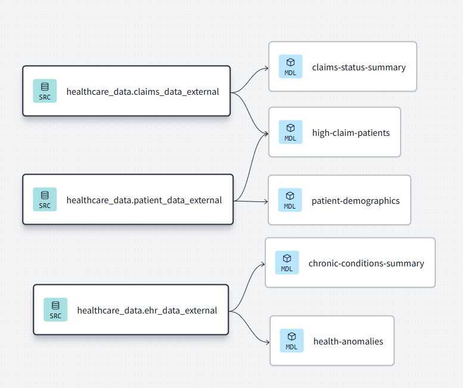
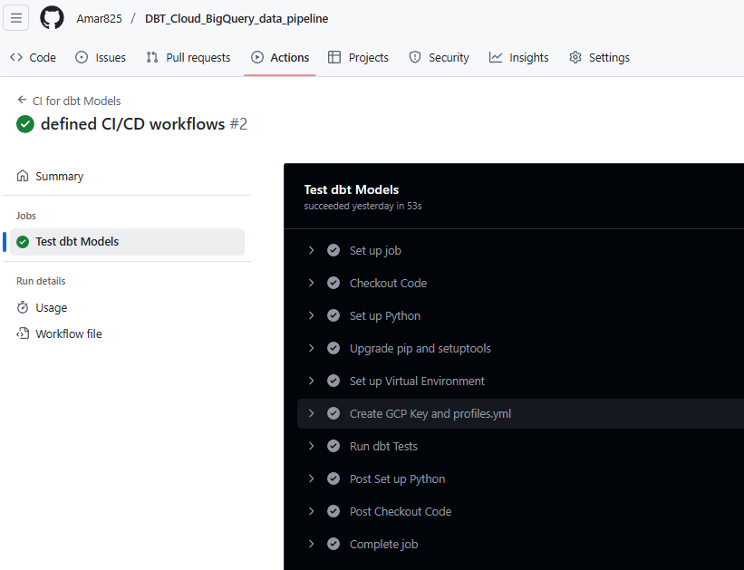
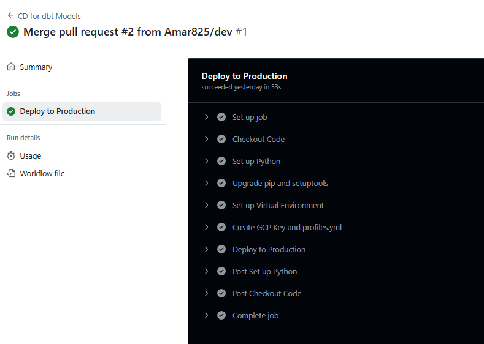

# dbt-GCP-BigQuery-Healthcare-data-pipeline 🚀  
**A fully automated, production-grade data pipeline on** **GCP** **using** **DBT**, **BigQuery**, **and GitHub Actions (CI/CD)** — **built to simulate a real-world healthcare analytics use case.**


---

## 📚 Table of Contents
1. [Project Overview](#project-overview)
2. [Tools & Technologies Used](#tools--technologies-used)
3. [Architecture Diagram](#architecture-diagram)
4. [Step-by-Step Workflow](#step-by-step-workflow)
   - [4.1 GCP Setup](#41-gcp-setup)
   - [4.2 BigQuery Datasets & GCS Buckets](#42-bigquery-datasets--gcs-buckets)
   - [4.3 Data Generation & Upload](#43-data-generation--upload)
   - [4.4 External Table Creation](#44-external-table-creation)
   - [4.5 DBT Modeling](#45-dbt-modeling)
   - [4.6 Testing & Documentation](#46-testing--documentation)
   - [4.7 CI/CD with GitHub Actions](#47-cicd-with-github-actions)
   - [4.8 Deployment to Production](#48-deployment-to-production)
   - [4.9 Scheduled Jobs & Looker Dashboard](#49-scheduled-jobs--looker-dashboard)
5. [Data Lineage & Model Flow](#data-lineage--model-flow)
6. [Screenshots & Walkthrough](#screenshots--walkthrough)
7. [Key Learnings](#key-learnings)


---

## 📌 1. Project Overview

This project demonstrates my ability to build a **scalable, production-grade data pipeline** using industry-standard tools. From raw data ingestion and transformation to CI/CD and visualization, this project simulates the daily responsibilities of a Data Engineer.

> ⚙️ Tech stack: GCP + BigQuery + DBT Core + GitHub Actions + Python 

---

## 🛠️ 2. Tools & Technologies Used

| Tool                | Purpose                                      |
|---------------------|----------------------------------------------|
| **Google Cloud Platform (GCP)** | Infrastructure & storage             |
| **BigQuery**         | Data warehouse / SQL engine                  |
| **Google Cloud Storage** | Raw data file storage                   |
| **DBT Core**         | Transformations, testing, documentation     |
| **GitHub Actions**   | CI/CD automation pipeline                   |
| **Python**           | Data generation script                      |

---

## 🧱 3. Architecture Diagram

This project follows a modular and automated data engineering architecture on Google Cloud.  
Raw synthetic healthcare data is generated and stored in GCS, externalized into BigQuery, transformed via DBT models, and deployed through CI/CD using GitHub Actions.

<p align="center">
  
</p>

---

## 🔁 4. Step-by-Step Workflow

### 4.1 GCP Setup
- Created a new Google Cloud project (`root-matrix-457217-p5`)
- Enabled **BigQuery**, **Cloud Storage**, and **IAM** APIs
- Created service accounts with proper IAM roles (`BigQuery Admin`, `Storage Admin`, etc.)
- - Created a dedicated **service account** in GCP for secure, programmatic access
- Assigned necessary roles:
  - `BigQuery Admin`
  - `Storage Admin`
  - `BigQuery Job User`
- Downloaded the service account's **JSON key**
- Used this key for:
  - Local development (`profiles.yml` with `keyfile:` path)
  - GitHub Actions (`gcp-key.json` generated dynamically from GitHub Secrets)

<p align="center">
  
</p>

### 4.2 BigQuery Datasets & GCS Buckets
- Created datasets:
  - `dev_healthcare_data`
  - `prod_healthcare_data`
- **Cloud Storage bucket (`healthcare-data-bucket-amarkhatri`) was created automatically by the Python script**

<p align="center">
  
</p>

### 4.3 Data Generation Script (Python)

To simulate a real-world healthcare data pipeline, I wrote a Python script that:

- Generates synthetic data using the **Faker** library for:
  - Patient demographics (`CSV`)
  - Electronic health records (`JSON`)
  - Insurance claims (`Parquet`)
- Creates a **Cloud Storage bucket** if it doesn't already exist
- **Cleans the target folders** before uploading new files
- Uploads raw data directly to GCS (`dev/` and `prod/` folders)
- Writes all files in appropriate formats using:
  - `pandas` for CSV
  - `json` for newline-delimited JSON
  - `pyarrow` for Parquet

✅ The script performs **all ingestion + staging steps programmatically**, without manual uploads.

> 📁 Script location: [`data_generator/synthetic_data_generator.py`](./data_generator/synthetic_data_generator.py)


### 4.4 External Table Creation in BigQuery
After uploading the raw data to GCS, I created **external tables** in BigQuery that reference those files directly — allowing SQL querying without loading the data into native BigQury storage.

- `patient_data.csv` → **CSV external table**
- `ehr_data.json` → **newline-delimited JSON external table**
- `claims_data.parquet` → **Parquet external table (schema-aware)**

These external tables were created for both:
- `dev_healthcare_data` dataset (5K test records)
- `prod_healthcare_data` dataset (20K records)

#### ✅ Why external tables though?:
- Cost-efficient for large, raw datasets
- Schema can be auto-detected or explicitly defined
- Queryable via standard SQL like any native table

#### 🧱 Table Creation SQL Example (CSV):

```sql
CREATE OR REPLACE EXTERNAL TABLE `project_id.dev_healthcare_data.patient_data_external`
OPTIONS (
  format = 'CSV',
  uris = ['gs://healthcare-data-bucket-amarkhatri/dev/patient_data.csv'],
  skip_leading_rows = 1
);
```
### 4.5 DBT Modeling

Once the raw data was available via external tables in BigQuery, I used **DBT Core** to build a structured transformation layer on top of it.

In this step, I created several DBT models that:
- Referenced external tables using `{{ source() }}`
- Performed aggregations and filtering logic (e.g., identifying high claim patients, summarizing chronic conditions)
- Joined datasets (e.g., patients with claims or EHR data)
- Were configured with DBT’s built-in materializations (`view`, `incremental`) for flexibility and performance
All transformations were written in modular `.sql` models, configured via `dbt_project.yml` and executed using DBT CLI or GitHub Actions.

  <p align="center">
  
</p>
 This lineage graph was generated using `dbt docs generate` and `dbt docs serve`.

It shows how each model in the pipeline is derived from raw external source tables in BigQuery:

- ✅ **Sources** (`SRC`) like `claims_data_external`, `patient_data_external`, and `ehr_data_external` represent external tables that directly query files stored in Google Cloud Storage
- ✅ **Models** (`MDL`) like `high-claim-patients`, `chronic-conditions-summary`, and `health-anomalies` represent transformed tables built using SQL logic in DBT 


#### 🧱 Key DBT Concepts Used:

- Used `{{ source() }}` to connect to external BigQuery tables backed by GCS
- Applied `{{ config(materialized='incremental') }}` to optimize model performance
- Structured models for clarity and reusability
- Defined column-level tests using `schema.yml` (e.g., `not_null`, `unique`)
  
### 4.6 Testing & Documentation
To ensure data quality and trust in the pipeline, I implemented column-level tests and added documentation using `schema.yml` files in DBT.
DBT allows us to define tests and metadata **alongside our models** — all inside YAML. These tests run automatically using `dbt test`.

#### ✅ Why I Used `schema.yml`:

- To enforce data integrity on critical columns (`not_null`, `unique`)
- To validate raw data coming from external sources
- To document model and column purposes using DBT's built-in documentation system
- To support CI/CD by catching schema or data issues automatically in GitHub Actions

---

#### 🧪 Sample Test Configuration

Here’s an example from `schema.yml`:

```yaml
version: 2

models:
  - name: high_claim_patients
    description: "Identifies patients with total claim amounts above a threshold"
    columns:
      - name: patient_id
        tests:
          - unique
          - not_null
      - name: total_claim_amount
        tests:
          - not_null
```

### 4.7 CI/CD with GitHub Actions
To automate testing and deployment of my DBT models, I configured **GitHub Actions** to handle CI (Continuous Integration) and CD (Continuous Deployment).

This ensures:
- ✅ Every **pull request** runs `dbt test` to validate models before merging
- ✅ Every **merge to main** triggers `dbt run` to deploy production models to BigQuery
- ✅ All deployments are version-controlled, reproducible, and secure

---

#### 🔁 Continuous Integration (`ci.yml`)

- Triggered on **pull requests to `main`**
- Spins up a fresh Ubuntu runner
- Installs Python + DBT
- Injects a secure GCP service account key via **GitHub Secrets**
- Generates a temporary `profiles.yml`
- Runs `dbt test` to validate schema and model logic

  <p align="center">  </p>  `

✅ Example snippet from `ci.yml`:

```yaml
on:
  pull_request:
    branches:
      - main

jobs:
  test:
    runs-on: ubuntu-latest
    steps:
      - uses: actions/checkout@v3
      - uses: actions/setup-python@v4
      - run: pip install dbt-bigquery
      - run: dbt test --profiles-dir /home/runner/.dbt --target dev
```

#### 🚀 Continuous Deployment (cd.yml)
Triggered on push to main

- Installs DBT, authenticates with GCP
- Runs dbt run with --target prod to build models into the production dataset

  #### 📁 Key Deployment Details

| Config         | Value |
|----------------|-------|
| Deployment method | GitHub Actions |
| Trigger         | `push` to `main` |
| DBT command     | `dbt run --target prod` |
| Destination     | `prod_healthcare_data` BigQuery dataset |
| Auth method     | GCP service account via GitHub Secrets |
| Environment     | Fresh Ubuntu runner (`ubuntu-latest`) |

  <p align="center">  </p>

✅ Secure deployment:

GCP credentials stored as GitHub Secrets

gcp-key.json and profiles.yml are generated at runtime (not stored in repo)

## 📘 Key Learnings

- Developed a clear understanding of DBT’s transformation flow and model structure
- Gained hands-on experience integrating Python, BigQuery, and GCS for cloud data pipelines
- Learned how to build secure, production-ready CI/CD pipelines using GitHub Actions
- Practiced writing modular, testable SQL models with automated validations
- Built an end-to-end pipeline that mirrors real-world engineering workflows

## ✅ Conclusion

This project started as a hands-on learning exercise and became a full-stack, automated data engineering pipeline. I worked with industry-standard tools (GCP, DBT, GitHub Actions), built my own data sources, and pushed transformations all the way to production.

It reflects both the technical skills I’ve developed and my drive to learn independently and build real, usable solutions.

---

## 🙏 Acknowledgements

This project was built by closely following a YouTube tutorial by [DATA ](https://www.youtube.com/playlist?list=PLs9W2D7jqlTXbHWkpNUzIC_G8KpLMH6yZ), which covered how to build an end-to-end data pipeline using DBT, BigQuery, and GitHub Actions.

My goal with this project was not to invent something new, but to:
- Rebuild the full pipeline on my own
- Understand every component (GCP, DBT, CI/CD)
- Practice deploying it in a production-ready, portfolio-quality format
- Document my learning in a way that demonstrates my technical depth and readiness for real-world work

All credit for the project architecture and approach goes to the original creator — this repo reflects my hands-on execution of the same, and my own journey of learning through replication.


